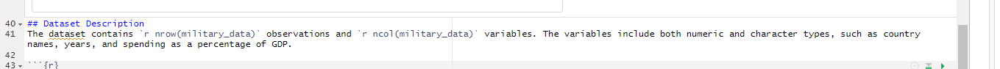

```{r}
#| warning: FALSE
#| include: FALSE

# Load libraries 
library(tidyverse)
library(knitr)
library(ggplot2)

# Load raw data
military_data <- read.csv("data/military-spending.csv")

```

# Overview and purpose

In today's world military spending is a critical aspect of national budget and global security. This report dives into the trends in military spending across four nations Australia, China, India and Russia and aims to provide insights into global security priorities complemented with economic impacts. The analysis will focus on identifying patterns of spending over the years and, a positive correlation in military spending and population in Australia.

# Research Question

How has military spending changed over time across each country? Are there any significant correlation between military spending and other factors like population? This report aims to answer these questions using data provided by Stockholm International Peace Research Institute (2024) in our world of data.

# Dataset

The dataset used in this report contains information on military spending of Australia, China India and Russia between 2012 - 2023. Shown in @tbl-var, the dataset includes variables such as entity (country name), year, Military_exp (military spending), Population and Military_Exp_Gdp (military spending as a percentage of GDP). The data is sourced from Our World in Data, which compiles data from reliable international sources. This dataset provides a comprehensive view of global military spending trends. The data can be accessed [here](https://ourworldindata.org/military-personnel-spending).

```{r}
#| label: tbl-var
#| tbl-cap: "Variable names in the military spending dataset"
variable_names <- colnames(military_data)
kable(variable_names)
```

## Dataset Description

The dataset contains `r nrow(military_data)` observations and `r ncol(military_data)` variables. The variables include both numeric and character types, such as country names, years, and spending as a percentage of GDP.

```{r}
#| out.width: "100%"
#| out-height: "10%"
#| fig-cap: "Dataset description (R code)"

```

```{r}
# Identify first two columns
head_data <- head(military_data, 2)

#Identify the class
variable_types <- sapply(military_data, class)

# Combine two rows
head_with_variables <- rbind(Variable_Type = variable_types, head_data)

# Create table
knitr::kable(head_with_variables, 
             caption = "First 2 rows of datset with variable types")
```

# Results

-   @fig-graph *shows the positive relationship between military spending and population in Australia between 2012 - 2023*
-   @fig-2 *shows how military spending increased in countries over the 10 year period (2012 - 2023)*

```{r}
#| label: fig-graph
#| fig-cap: "Military Spending vs Population in Australia"

# Convert Military_exp to billions
military_data <- military_data |>
  mutate(Military_exp = Military_exp / 1e9)

# Convert Population to Millions
military_data <- military_data |>
  mutate(Population = Population / 1e6)

# Filter Australia
australia_data <- military_data |>
  filter(Entity == "Australia")

# Plot a line graph 
ggplot(
  australia_data, 
  aes(x = Population, y = Military_exp, color = Entity)) +
  geom_line() +
  labs(
    title = "Correlation between population and military spending in Australia",
    x = "Population (in Millions)",
    y = "Military Spending (inBillion USD)"
  ) + 
  theme_light() +
  # Align the caption and change font size
  theme(
    plot.caption = element_text(hjust = 0.5),
    plot.title = element_text(size = 12)
  )
```

```{r}
#| label: fig-2
#| fig-cap: "Military Spending"

library(tidyverse)

# Filter to keep only the first and last years for each country
filtered_data <- military_data |>
  group_by(Entity) |>
  filter(Year == min(Year) | Year == max(Year)) |>
  ungroup()  

# Plotting
ggplot(filtered_data, 
       aes(x = factor(Year), 
           y = Military_exp, 
           fill = Entity)
       ) +
  geom_col(position = "dodge") +
  labs(
    x = "Year", 
    y = "Military Expenditure (in Billion USD)",
    title = "Military Expenditure of Countries (2012 & 2023)"
  ) +
  theme_light()
```
